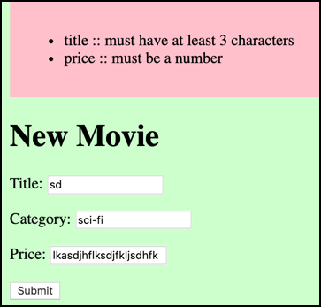

# evote-movie-2020-23-validation

When the user enters a new Movie, let's validate the fields. If there errors:

- do NOT create a new record in the DB
- display a list of error messages
- use gthe submitted (bad) data to populate the Movie form, so the user does not have to re-type values again




- let's add an IF-statement in our `MovieController` method to `processNewMovie()`:

    ```php
    public function processNewMovie()
    {
        $title = filter_input(INPUT_POST, 'title');
        $category = filter_input(INPUT_POST, 'category');
        $price = filter_input(INPUT_POST, 'price');
    
        $movie = new Movie();
        $movie->setTitle($title);
        $movie->setCategory($category);
        $movie->setPrice($price);
        $movie->setVoteTotal(0);
        $movie->setNumVotes(0);
    
        $errors = $this->validateMovie($movie);
    
        if(!empty($errors)){
            // invoke create form again - passing movie object and error array
            $this->createForm($errors, $movie);
    
        } else {
            // add movie to DB & list movies
            $this->movieRepository->create($movie);
            $this->listMovies();
        }
    }
    ```
  
    - so if the array of errors returned by method `validateMovie($movie)` is not empty, we'll re-run the `createForm(...)` method, passing the errors and Movie object (containing the data submitted by the user)
    
- here is our updated `createForm(...)`. This now has 2 parameters, defaulting to `[]` and `null`, but allowing an array of errors and a Movie object to be passed to it, if we wish to re-display the new Movie form, showing error messages and sticky-data: 
    
    ```php
    public function createForm($errors = [], $movie = null)
    {
        $template = 'newMovieForm.html.twig';
    
        if(count($errors) > 0) {
            $args = [
                'errors' => $errors,
                'movie' => $movie
            ];
        } else{
            $args = [];
        };
    
        $html = $this->twig->render($template, $args);
        print $html;
    }
    ```
  
    - if the `errors` array is empty, no variables are passed to Twig template `newMovieForm.html.twig`
    
- here is our `MovieController` method to validate the values submitted by the user for a new Movie form. In a nutshell, we add String error messages to the array returned by this method, each time a validation error is found in the data submitted by the user. The array of errors (whether emptyu or not) is returned after all validation has been completed:

    ```php
    private function validateMovie(Movie $movie)
    {
        $errors = [];
    
        // title
        if(empty($movie->getTitle())){
            $errors[] = "title :: must have a value";
        } else {
            if(strlen($movie->getTitle()) < 3) {
                $errors[] = "title :: must have at least 3 characters";
            }
        }
    
        // category
        if(empty($movie->getCategory())){
            $errors[] = "category :: must have a value";
        } else {
            if(strlen($movie->getCategory()) < 3) {
                $errors[] = "category :: must have at least 3 characters";
            }
        }
    
        // price
        if(empty($movie->getPrice())) {
            $errors[] = "price :: must have a value";
        } else {
            if(!is_numeric($movie->getPrice())) {
                $errors[] = "price :: must be a number";
            }
        }
    
        return $errors;
    }
    ``` 

- finally, we need to update our Twig template to display the new movie form `/templates/newMovieForm.htmn.twig`:

    - the form will populate the HTML inputs with values from Twig variables:
        
        ```twig
        <form action="/" method="post">
            <input type="hidden" name="action" value="processNewMovie">
        
            <p>
                Title:
                <input name="title" value="{{ title }}">
            <p>
                Category:
                <input name="category" value="{{ category }}">
            <p>
                Price:
                <input name="price" value="{{ price }}">
            <p>
                <input type="submit">
        </form>
        ```
      
    - these Twig variables are initialised to be empty strings:
    
        ```twig
        
        
        
        ```
      
    - however, if a `movie` variable has been passed to this template, then we'll use the values in that object for our form values:
    
        ```twig
        
            
            
            
        
        ```
      
    - if the length of array `errors` is greater than zero, then we'll loop through it displaying a bulleted list of error messages:
    
        ```twig
        
            <div  class="error">
                <ul>
                    
                        <li>{{ error }}</li>
                    
                </ul>
            </div>
        
        ```
      
- here is the complete Twig template `/templates/newMovieForm.htmn.twig` with all these extra features:

```twig


new movie


    
    
    

    
        
        
        
    


    
        <div  class="error">
            <ul>
                
                    <li>{{ error }}</li>
                
            </ul>
        </div>
    

    <h1>
        New Movie
    </h1>

    <form action="/" method="post">
        <input type="hidden" name="action" value="processNewMovie">

        <p>
            Title:
            <input name="title" value="{{ title }}">
        <p>
            Category:
            <input name="category" value="{{ category }}">
        <p>
            Price:
            <input name="price" value="{{ price }}">
        <p>
            <input type="submit">
    </form>


```


